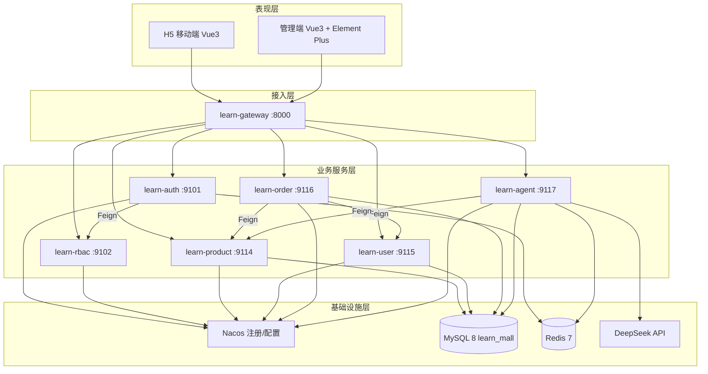
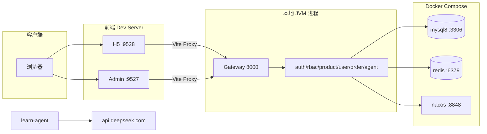
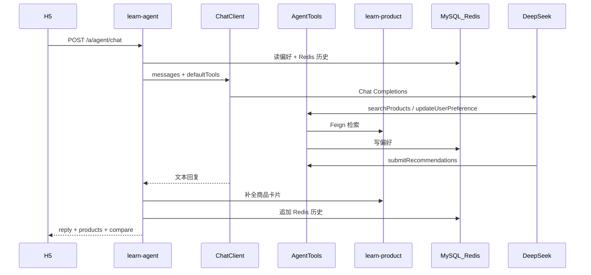
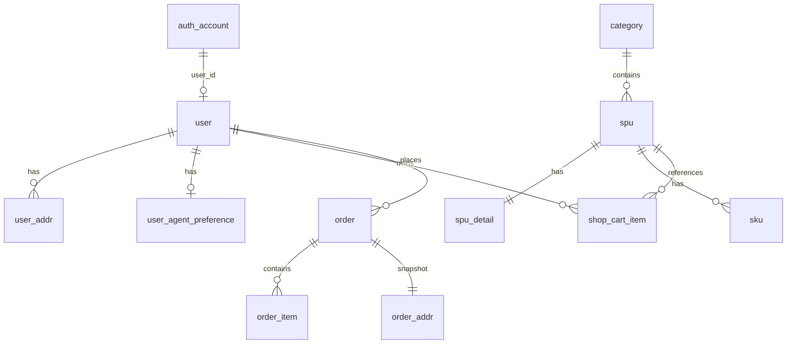
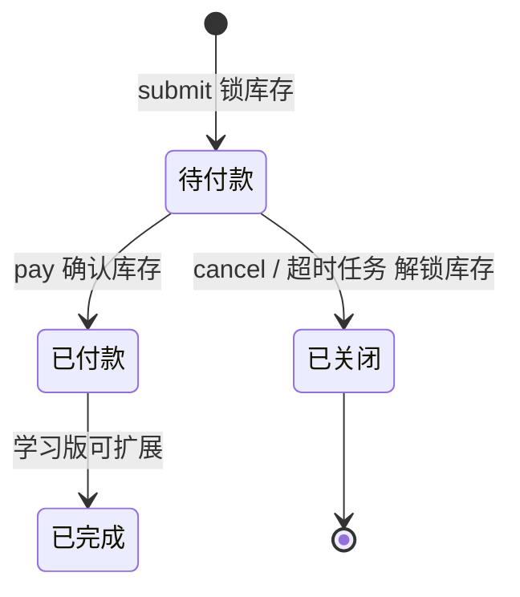

# Learn Mall 学习版 — 概要设计文档

| 文档版本 | 1.0 |
|---------|-----|
| 项目名称 | Learn Mall（mall4cloud-learn） |
| 编写日期 | 2026-07-04 |
| 关联文档 | [需求分析文档](./需求分析文档.md) |
| 文档状态 | 与 Phase 0～5 实现一致 |

---

## 1. 文档目的

本文档在需求分析基础上，描述 Learn Mall 的**总体架构、模块划分、部署拓扑与技术选型**，为详细设计与开发实现提供统一的技术视图。读者对象：开发人员、测试人员、课程学习者。

---

## 2. 设计原则

| 原则 | 说明 |
|------|------|
| **微服务拆分** | 按业务域划分独立服务，便于独立部署与学习 |
| **统一网关入口** | 所有外部请求经 Gateway 路由，屏蔽内部拓扑 |
| **公共能力下沉** | 响应封装、鉴权、缓存、Feign 等沉淀至 learn-common |
| **接口契约先行** | 跨服务调用通过 learn-api 模块定义 Feign 接口 |
| **学习版适度简化** | 单店铺、单 SKU/SPU、模拟支付，降低复杂度 |
| **AI 能力可插拔** | Agent 独立服务，通过 Tool Calling 访问商品与偏好，不侵入核心业务 |

---

## 3. 系统架构

### 3.1 逻辑架构（分层视图）



### 3.2 部署架构（本地开发）



### 3.3 请求链路

**典型 H5 请求：**

```
浏览器 → Vite Proxy → Gateway(8000)
  → /learn-{serviceId}/...  （Discovery Locator 自动路由）
  → 目标微服务 AuthFilter 鉴权
  → Controller → Service → Mapper/Feign
  → ServerResponseEntity 统一 JSON 响应
```

**路由规则：**

| 路径前缀 | 含义 | 鉴权 |
|----------|------|------|
| `/ua/**` | 对外公开（Unauthenticated） | 免登录 |
| `/a/**` | App 端登录用户 | Authorization Token |
| `/admin/**` | 管理端 | Admin Token + RBAC |
| `/feign/insider/**` | 服务间内部调用 | key/secret |

**Gateway 配置要点：**

- 启用 `spring.cloud.gateway.server.webflux.discovery.locator`，服务 ID 小写；
- 无需手写 routes，依赖 Nacos 服务发现；
- 全局 CORS 开启；响应超时 120s（适配 Agent 长耗时）。

---

## 4. 模块划分

### 4.1 后端 Maven 模块总览

```
learn-mall (父 POM)
├── learn-common          # 公共基础模块（多子模块）
├── learn-api             # 跨服务 Feign 接口与 DTO/VO
├── learn-gateway         # API 网关
├── learn-auth            # 认证登录
├── learn-rbac            # 角色权限与菜单
├── learn-demo            # 演示/健康检查
├── learn-product         # 商品、分类、购物车、库存
├── learn-user            # 用户资料、收货地址
├── learn-order           # 订单、支付、定时关单
└── learn-agent           # Spring AI 购物助手
```

### 4.2 learn-common 公共模块

| 子模块 | 职责 | 核心组件 |
|--------|------|----------|
| **learn-common-core** | 通用工具与横切能力 | `ServerResponseEntity`、`DefaultExceptionHandlerConfig`、`Json`、`PageDTO/PageVO`、Feign 拦截器 |
| **learn-common-cache** | Redis 缓存 | `RedisCacheConfig`、`RedisTemplate`、Jackson 序列化 |
| **learn-common-database** | 数据库 | `MybatisConfig`、数据源自动配置 |
| **learn-common-security** | 安全鉴权 | `AuthFilter`、`AuthUserContext`、`PasswordEncoder`、RBAC 权限校验 |
| **learn-common-nacos** | 注册发现增强 | 本地开发强制注册 IP（解决 Windows/Nacos 路由问题） |

**共享配置文件：** `application-learn-mall-defaults.yml`（Redis/Feign 超时、各服务本地直连 URL）。

### 4.3 learn-api 接口契约模块

| 子模块 | Feign Client | 消费方 |
|--------|--------------|--------|
| learn-api-auth | `TokenFeignClient`、`AccountFeignClient` | gateway/auth/user |
| learn-api-rbac | `PermissionFeignClient` | auth/security |
| learn-api-product | `ProductFeignClient` | order、agent |
| learn-api-user | `UserAddrFeignClient` | order |

各业务服务通过 `@RestController implements XxxFeignClient` 暴露内部接口。

### 4.4 业务微服务职责

| 服务 | 端口 | 职责 | 主要数据 |
|------|------|------|----------|
| **learn-auth** | 9101 | 登录/登出、Token 签发与校验 | auth_account + Redis Token |
| **learn-rbac** | 9102 | 菜单、角色、权限校验 | menu、role、role_menu |
| **learn-product** | 9114 | 分类、SPU/SKU、购物车、库存锁 | category、spu、sku、shop_cart_item |
| **learn-user** | 9115 | 注册、用户资料、收货地址 | user、user_addr |
| **learn-order** | 9116 | 下单、模拟支付、取消、定时关单 | order、order_item、pay_info |
| **learn-agent** | 9117 | AI 对话、偏好管理、Tool 编排 | user_agent_preference + Redis 对话 |
| **learn-gateway** | 8000 | 统一入口、CORS、服务路由 | — |
| **learn-demo** | 9100 | 架构演示 Ping | — |

### 4.5 业务服务内部分层

各微服务采用统一分层结构：

```
com.learn.mall.{service}/
├── XxxApplication.java          # 启动类
├── controller/
│   ├── app/                     # /a/**、/ua/** 对外 API
│   └── admin/                   # /admin/** 管理端 API
├── feign/                       # Feign 接口实现（/feign/insider/**）
├── service/ + service/impl/     # 业务逻辑
├── mapper/ + resources/mapper/  # MyBatis XML
├── model/                       # 实体
├── dto/ / vo/                   # 入参出参
└── task/                        # 定时任务（如 OrderCancelTask）
```

### 4.6 前端模块

| 项目 | 技术 | 端口 | 职责 |
|------|------|------|------|
| **mall-h5** | Vue 3 + Vite + Vue Router + Axios | 9528 | C 端：浏览、购物车、订单、Agent、个人中心 |
| **admin** | Vue 3 + Element Plus + Pinia | 9527 | B 端：商品/分类/订单管理、动态菜单 |

**H5 页面模块：**

| 模块 | 页面 | 说明 |
|------|------|------|
| 首页 | Home | 搜索、轮播、商品列表 |
| 分类 | Category | 分类 Tab + 商品 |
| 商品 | Detail | 详情、加购、收藏、评论 |
| 购物车 | Cart | 勾选、结算 |
| 订单 | OrderConfirm/Pay/List/Detail | 下单全流程 |
| 用户 | Login/Register/My/Profile/Address | 账号与资料 |
| Agent | Agent/AgentPreferences | AI 对话与偏好 |
| 营销演示 | SignIn/CouponCenter/Favorites | 本地/前端演示 |

**Admin 页面模块：**

- 商品列表 / 编辑（`product/spu`）
- 分类管理（路由已配置，组件可扩展）
- 订单管理（Phase 4）

### 4.7 Agent 子系统架构



**Agent 核心类：**

| 类 | 职责 |
|----|------|
| `AgentChatConfig` | ChatClient Bean、System Prompt |
| `AgentTools` | `@Tool` 工具：检索商品、读写偏好、提交推荐 |
| `AgentChatServiceImpl` | 对话编排、对比表组装 |
| `AgentChatHistoryServiceImpl` | Redis 多轮上下文 |
| `UserAgentPreferenceServiceImpl` | MySQL 偏好 CRUD |

---

## 5. 技术选型说明

### 5.1 技术栈总表

| 层次 | 技术 | 版本 | 选型理由 |
|------|------|------|----------|
| 语言 | Java | 17 LTS | 生态成熟，Spring Boot 4 基线要求 |
| 后端框架 | Spring Boot | 4.0.3 | 最新 LTS 路线，统一依赖管理 |
| 微服务 | Spring Cloud | 2025.1.1 | 与 Boot 4 配套的云原生组件 |
| 阿里云组件 | Spring Cloud Alibaba | 2025.1.0.0 | Nacos 注册发现，国内文档丰富 |
| 注册中心 | Nacos | 3.1.1 | 服务发现 + 可选配置，学习成本低 |
| API 网关 | Spring Cloud Gateway | 2025.1.x | WebFlux 异步、Discovery Locator 自动路由 |
| RPC | OpenFeign + LoadBalancer | 2025.1.x | 声明式 HTTP 调用，与 Spring Cloud 深度集成 |
| ORM | MyBatis | 4.0.1 (starter) | SQL 可控，适合学习 SQL 与映射 |
| 数据库 | MySQL | 8.0 | 主流关系型数据库，Docker 一键部署 |
| 缓存 | Redis | 7.x | Token、Agent 对话历史、Spring Cache |
| AI | Spring AI | 2.0.0 | Boot 4 原生支持，Tool Calling 标准化 |
| 大模型 | DeepSeek API | deepseek-chat | OpenAI 兼容接口，性价比高，国内可用 |
| 工具库 | Hutool | 5.8.29 | 字符串、工具类补充 |
| JSON | Jackson 3 | Boot 4 内置 | Redis 序列化与 API 序列化 |
| 前端框架 | Vue | 3.5.x | 组合式 API，生态完善 |
| 构建工具 | Vite | 6.x | 快速 HMR，开发体验好 |
| Admin UI | Element Plus | 2.9.x | 企业级组件库，管理端标配 |
| HTTP 客户端 | Axios | 1.7.x | 拦截器统一处理 Token 与错误码 |
| 容器 | Docker Compose | — | 本地一键启动 MySQL/Redis/Nacos |

### 5.2 关键选型详解

#### 5.2.1 为何采用微服务而非单体？

- **教学目标**：对照 Mall4cloud 原版架构，理解 Gateway、Nacos、Feign 等组件协作；
- **域边界清晰**：商品/订单/用户/Agent 可独立演进；
- **代价可控**：学习版仅 7 个业务服务，本地可同时启动。

#### 5.2.2 为何 Gateway + Nacos Discovery Locator？

- 无需维护大量静态路由配置；
- 前端统一访问 `http://gateway:8000/learn-{service}/...`，与生产环境路径一致；
- 服务上下线由 Nacos 自动感知。

#### 5.2.3 为何 MyBatis 而非 JPA？

- 复杂查询（分类树、库存锁、Agent 模糊搜）SQL 更直观；
- 与 Mall4cloud 原版技术栈一致，便于对照学习；
- Mapper XML 便于展示 SQL 优化与索引设计。

#### 5.2.4 为何 Redis 多用途复用？

| 用途 | Key 模式 | 服务 |
|------|----------|------|
| 登录 Token | `ACCESS*` 等（TokenStore） | auth |
| Agent 对话历史 | `agent:chat:{userId}` | agent |
| Spring Cache | 按 CacheNames 配置 | 各服务可选 |

统一 Redis 实例降低本地部署复杂度；生产环境可按用途分库。

#### 5.2.5 为何 Spring AI + Tool Calling？

- **可控性**：LLM 不直接访问 DB，仅通过预定义 Tool 调 Feign；
- **结构化输出**：`submitRecommendations` 提交商品 ID 与优缺点，后端组装 UI 所需对比表；
- **可替换**：DeepSeek 通过 OpenAI 兼容配置切换，未来可换其他模型；
- **与 Boot 4 对齐**：Spring AI 2.0 专为 Boot 4 设计，避免版本冲突。

#### 5.2.6 为何 H5 不用 UI 框架？

- 学习版侧重业务流程与接口联调，手写 CSS 减少依赖；
- 移动端 TabBar、Agent 对话等定制 UI 较多；
- Admin 端使用 Element Plus 满足后台表格表单需求。

#### 5.2.7 鉴权方案

```
AuthFilter (Servlet)
  → 白名单：/ua/**、/feign/insider/**、/actuator/**
  → TokenFeignClient 校验 Token → AuthUserContext
  → 管理端额外 PermissionFeignClient 校验 RBAC
```

Token 存 Redis，Gateway 透传 `Authorization` Header，各服务独立校验（去中心化鉴权，与 Mall4cloud 一致）。

---

## 6. 数据架构概要

### 6.1 数据库

- **库名**：`learn_mall`（业务）、`learn_nacos`（Nacos 可选）
- **脚本分期**：`phase1-auth-rbac` → `phase2-product` → `phase3-user` → `phase4-order` → `phase5-agent`
- **命名规范**：下划线字段，MyBatis 驼峰映射

### 6.2 核心表关系（简化 ER）



### 6.3 订单与库存协作



---

## 7. 接口设计规范

### 7.1 统一响应

```json
{
  "code": "00000",
  "msg": null,
  "data": { },
  "success": true
}
```

- 成功码：`00000`（`ResponseEnum.OK`）
- HTTP 状态码统一 200，错误通过 `code` 区分
- 常见错误：`A00004` 未登录、`A00005` 服务器异常

### 7.2 分页约定

- 请求：`pageNum`、`pageSize`（`PageDTO`）
- 响应：`list`、`total`、`pages`（`PageVO`）

### 7.3 Feign 内部调用

- 路径前缀：`/feign/insider/`
- 请求头：`key`、`secret`（`FeignBasicAuthRequestInterceptor`）
- 本地开发：`application-learn-mall-defaults.yml` 配置各服务直连 URL

---

## 8. 非功能设计要点

| 类别 | 设计措施 |
|------|----------|
| **性能** | Feign/Redis 超时 3～5s；Gateway 对 Agent 路由 120s；商品检索 LIMIT 限制 |
| **一致性** | 下单/支付/取消用 `@Transactional` + 库存三阶段（锁/确认/解锁） |
| **安全** | BCrypt 密码、Token Redis、API Key 环境变量、Tool 隔离 |
| **可观测** | Actuator health/info；各服务独立日志 |
| **扩展** | 新增微服务：注册 Nacos + 增加 learn-api 模块 + Gateway 自动发现 |

---

## 9. 目录与仓库结构

```
mall4cloud-learn/
├── docs/                    # 项目文档
├── db/                      # 分阶段 SQL 脚本
├── deploy/                  # docker-compose.yml
├── learn-common/            # 公共模块
├── learn-api/               # Feign 契约
├── learn-gateway/
├── learn-auth/
├── learn-rbac/
├── learn-product/
├── learn-user/
├── learn-order/
├── learn-agent/
├── learn-demo/
├── front-end/
│   ├── mall-h5/
│   └── admin/
├── pom.xml
└── README.md
```

---

## 10. 演进与扩展建议

| 方向 | 建议 |
|------|------|
| 支付 | 接入微信/支付宝 SDK，独立 learn-payment 服务 |
| Agent | 引入向量库 RAG、SSE 流式输出、服务端存储完整 UI 消息 |
| 营销 | 签到/优惠券后端化，独立 learn-marketing |
| 部署 | K8s + Helm，Nacos 集群，Redis/MySQL 主从 |
| 监控 | Micrometer + Prometheus + Grafana |

---

## 11. 修订记录

| 版本 | 日期 | 修订内容 | 作者 |
|------|------|----------|------|
| 1.0 | 2026-07-04 | 初稿：架构、模块、技术选型 | — |
