# Learn Mall 学习版 — 详细设计文档

| 文档版本 | 1.0 |
|---------|-----|
| 项目名称 | Learn Mall（mall4cloud-learn） |
| 编写日期 | 2026-07-04 |
| 关联文档 | [需求分析文档](./需求分析文档.md) · [概要设计文档](./概要设计文档.md) |
| 文档状态 | 与 Phase 0～5 实现一致 |

---

## 1. 文档目的与范围

本文档在概要设计基础上，对 **认证鉴权、订单与库存、AI 购物助手** 三个核心模块给出详细设计，包括：

- 业务流程图、类图、时序图（Mermaid）
- 关键算法与并发控制策略
- 数据库表结构、索引与 ER 关系

读者对象：开发人员、测试人员、课程学习者。实现代码以 `mall4cloud-learn` 仓库为准。

---

## 2. 认证鉴权模块（learn-auth + learn-common-security）

### 2.1 模块职责

| 组件 | 包路径 | 职责 |
|------|--------|------|
| `LoginController` | learn-auth | 登录 `/ua/login`、登出 `/login_out` |
| `AuthAccountServiceImpl` | learn-auth | 用户名密码校验（BCrypt） |
| `TokenStore` | learn-auth | Token 签发、校验、删除（Redis） |
| `TokenFeignController` | learn-auth | 供各服务 Feign 校验 Token |
| `AuthFilter` | learn-common-security | Servlet 过滤器：Token 校验 + RBAC |

### 2.2 登录流程

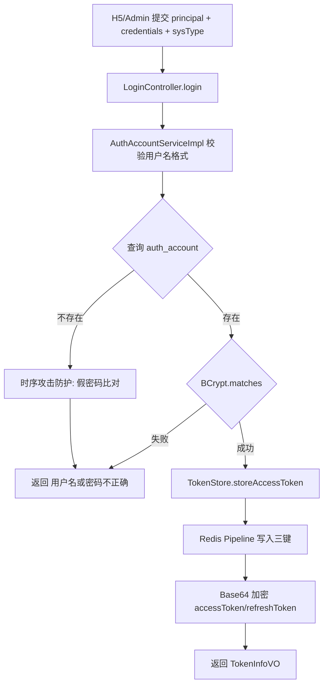

### 2.3 请求鉴权流程

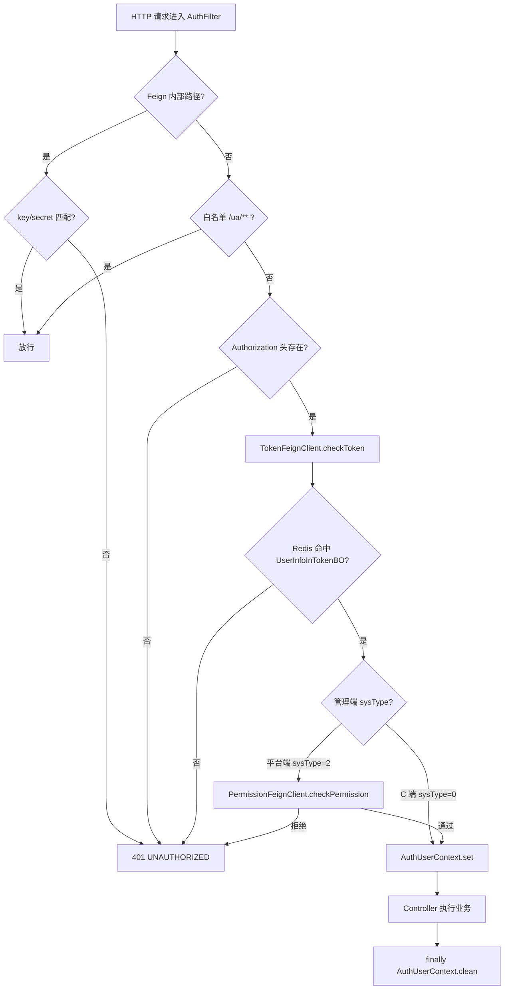

### 2.4 类图

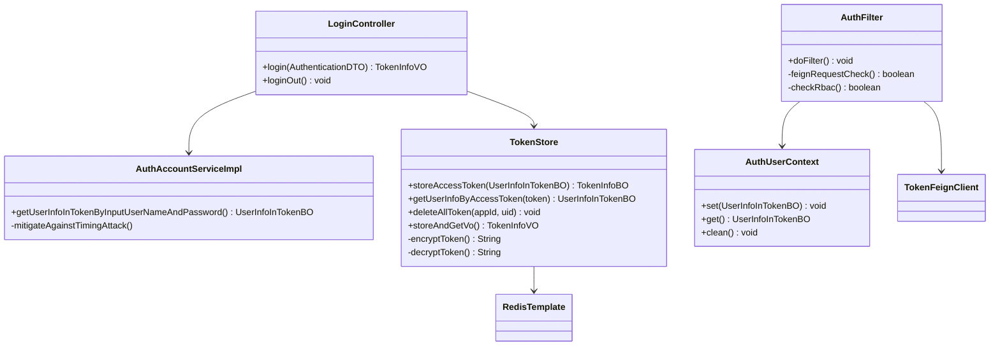

### 2.5 登录时序图

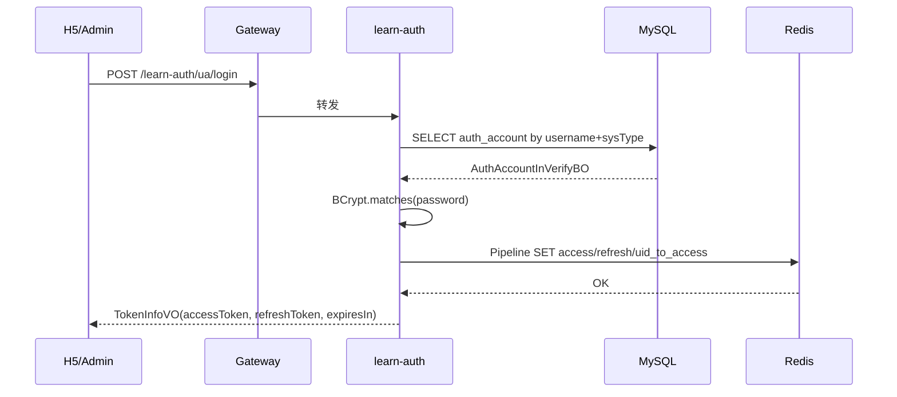

### 2.6 Token 存储算法

#### 2.6.1 Redis Key 设计

| Key 模式 | 类型 | 值 | TTL |
|----------|------|-----|-----|
| `learn_oauth:token:access:{rawToken}` | String | `UserInfoInTokenBO`（Jackson 序列化） | expiresIn |
| `learn_oauth:token:refresh_to_access:{refreshToken}` | String | raw accessToken | expiresIn |
| `learn_oauth:token:uid_to_access:{sysType:uid}` | Set | `{accessToken}:{refreshToken}` 列表 | expiresIn |

#### 2.6.2 签发流程（`TokenStore.storeAccessToken`）

1. 生成 `accessToken`、`refreshToken`（各 32 位 UUID 无横线）。
2. 读取 `uid_to_access` Set 中已有 Token 对，过滤仍有效的 access key。
3. **Redis Pipeline 原子批量写入**：
   - `SADD uid_to_access` 全部有效 Token 对 + 新 Token 对；
   - `EXPIRE uid_to_access`；
   - `SETEX refresh_to_access`；
   - `SETEX access`（序列化用户信息）。
4. 对外返回 **Base64 加密 Token**：`Base64(accessToken + timestamp + sysType)`，防止裸 UUID 泄露。

#### 2.6.3 校验流程

1. `AuthFilter` 从 `Authorization` 头取加密 Token。
2. `TokenFeignClient.checkToken` → `TokenStore.getUserInfoByAccessToken`：
   - Base64 解码 → 截取前 32 位得 raw accessToken；
   - 校验 timestamp 未超 `expiresIn`；
   - `GET learn_oauth:token:access:{rawToken}`。
3. 命中则返回 `UserInfoInTokenBO`，写入 `AuthUserContext`。

#### 2.6.4 过期策略

- 默认 `expiresIn = 3600 * 24 * 30` 秒（30 天），适用于 C 端/平台端/商家端。
- Redis Key 到期自动失效；登出时 `deleteAllToken` 遍历 Set 删除全部关联 Key。

#### 2.6.5 安全设计

| 措施 | 实现 |
|------|------|
| 密码存储 | BCrypt（`$2a$10$...`） |
| 用户不存在时序攻击 | 预编码假密码 `USER_NOT_FOUND_SECRET`，仍执行 `matches` |
| Token 传输 | Base64 包装 + HTTP Header |
| Feign 内部调用 | `/feign/insider/**` 需 `key`/`secret` 请求头 |
| RBAC | 仅 `sysType=2/3` 走 `PermissionFeignClient` |

---

## 3. 订单与库存模块（learn-order + learn-product）

### 3.1 模块职责

| 组件 | 服务 | 职责 |
|------|------|------|
| `AppOrderController` | learn-order | C 端下单/支付/取消/查询 |
| `OrderServiceImpl` | learn-order | 订单业务编排 |
| `OrderTransactionServiceImpl` | learn-order | 订单落库事务（地址快照、明细、删购物车） |
| `OrderCancelTask` | learn-order | 定时扫描超时未付订单 |
| `StockServiceImpl` | learn-product | 库存三阶段：锁/解锁/确认 |
| `ProductFeignController` | learn-product | 暴露库存与购物车 Feign 接口 |

### 3.2 订单状态机

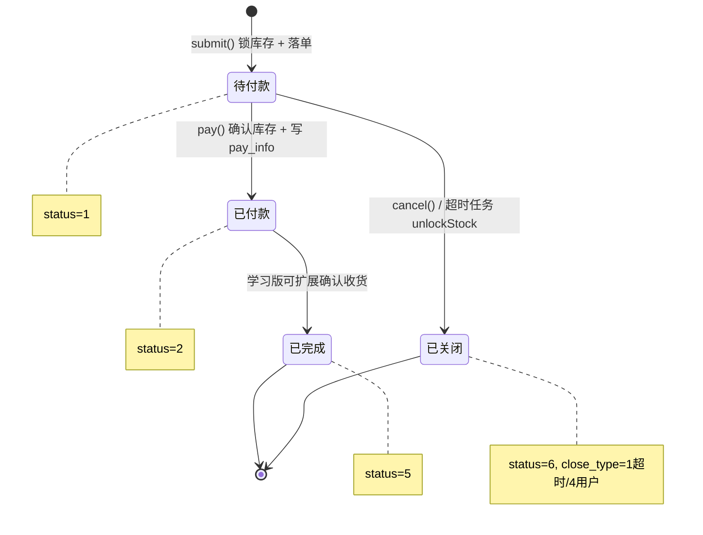

### 3.3 下单流程图

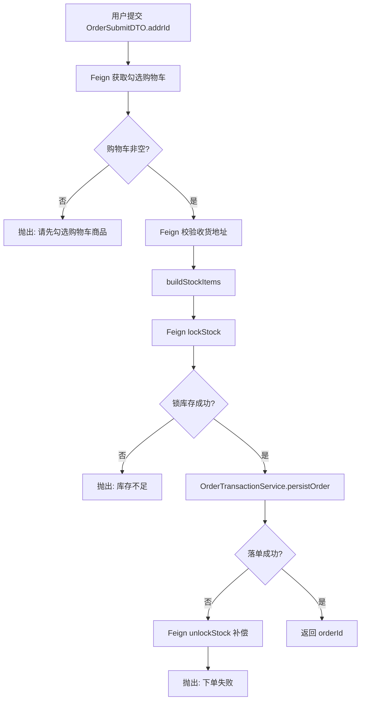

### 3.4 类图

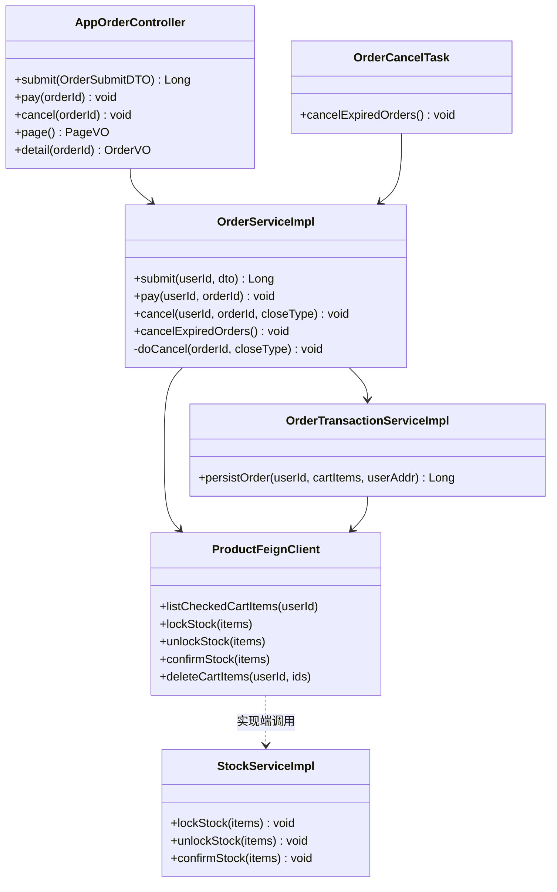

### 3.5 下单时序图

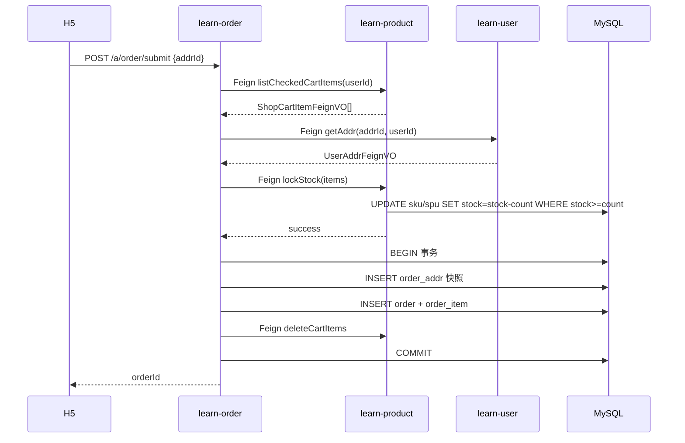

### 3.6 支付与取消时序图

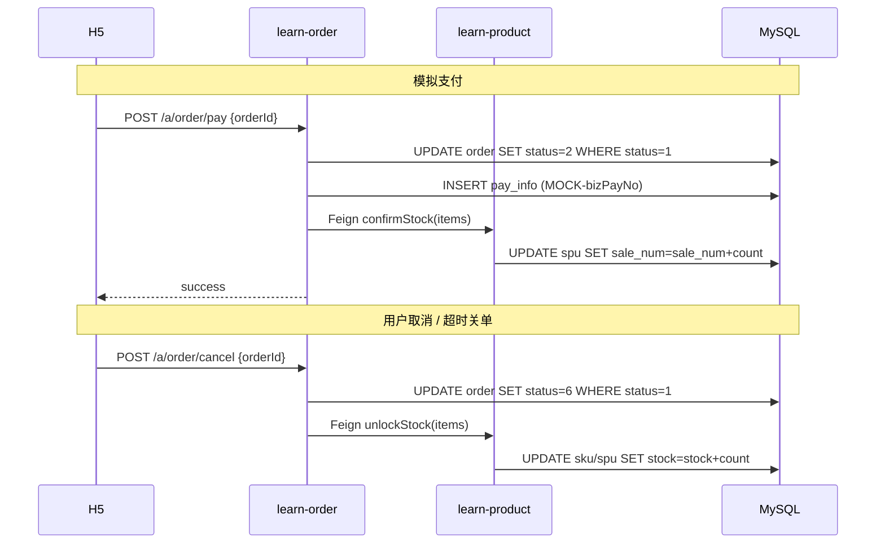

### 3.7 库存三阶段算法

学习版采用 **「下单减可用库存、支付增销量、取消回补库存」** 的简化模型（无独立 `stock_lock` 表）。

#### 3.7.1 锁库存（lockStock）

```sql
-- SkuMapper.reduceStock
UPDATE sku SET stock = stock - #{count}
WHERE sku_id = #{skuId} AND stock >= #{count};

-- SpuMapper.reduceStock（同步扣减展示库存）
UPDATE spu SET stock = stock - #{count}
WHERE spu_id = #{spuId} AND stock >= #{count};
```

**算法要点：**

- 逐行遍历订单项，SKU 与 SPU **双表同步扣减**；
- `WHERE stock >= count` 保证 **乐观锁语义**：影响行数为 0 则抛 `LearnMallException("商品库存不足")`；
- 整个 `lockStock` 方法 `@Transactional`，任一 SKU 失败则全部回滚。

#### 3.7.2 解锁库存（unlockStock）

```sql
UPDATE sku SET stock = stock + #{count} WHERE sku_id = #{skuId};
UPDATE spu SET stock = stock + #{count} WHERE spu_id = #{spuId};
```

触发场景：用户取消、超时关单、下单落库失败补偿。

#### 3.7.3 确认库存（confirmStock）

```sql
UPDATE spu SET sale_num = sale_num + #{count} WHERE spu_id = #{spuId};
```

支付成功后调用；SKU 库存已在锁库存阶段扣减，确认阶段 **仅增加销量**，不再动 SKU 表。

#### 3.7.4 分布式一致性说明

| 场景 | 策略 |
|------|------|
| 锁库存成功、落单失败 | `OrderServiceImpl.submit` catch 块调用 `unlockStock` 补偿 |
| 支付更新订单失败 | 本地 `@Transactional` 回滚 pay_info |
| 跨服务调用 | 学习版 **无 Seata**；依赖补偿 + 条件 UPDATE（`WHERE status=1`）保证幂等 |

### 3.8 超时关单算法

```java
// OrderCancelTask: @Scheduled(fixedRate = 60000) 每分钟执行
LocalDateTime expireBefore = now.minusMinutes(unpaidTimeoutMinutes); // 默认 30 分钟
List<Long> orderIds = orderMapper.listExpiredUnpaidIds(expireBefore);
// SQL: status=1 AND create_time < expireBefore
for (orderId : orderIds) {
    doCancel(orderId, CLOSE_TIMEOUT); // close_type=1
}
```

- `updateClose` 使用 `WHERE order_id=? AND status=1`，避免重复关单；
- 关单成功后 Feign `unlockStock`。

### 3.9 订单落库事务（persistOrder）

单库事务内顺序：

1. `INSERT order_addr`（从 `user_addr` 复制快照，防地址后续修改影响历史订单）；
2. 累计 `total`、`allCount`；
3. `INSERT order`（status=1 待付）；
4. 逐条 `INSERT order_item`（含 spuName、pic、price 快照）；
5. Feign `deleteCartItems` 清除已下单购物车项；
6. 返回 `orderId`。

---

## 4. AI 购物助手模块（learn-agent）

### 4.1 模块职责

| 组件 | 职责 |
|------|------|
| `AgentController` | `/a/agent/chat`、`/preference` CRUD |
| `AgentChatServiceImpl` | 对话编排：历史 + Prompt + ChatClient 调用 + 响应组装 |
| `AgentChatConfig` | `ChatClient` Bean、System Prompt |
| `AgentTools` | Spring AI `@Tool`：商品检索、偏好读写、提交推荐 |
| `AgentChatContext` | ThreadLocal：userId、推荐结果、偏好更新标记 |
| `AgentCompareBuilder` | 对比表/商品卡片 VO 组装 |
| `AgentChatHistoryServiceImpl` | Redis 多轮文本历史 |
| `UserAgentPreferenceServiceImpl` | MySQL 偏好 CRUD + Prompt 片段 |

### 4.2 Agent 对话流程图

```mermaid
flowchart TD
    A[POST /a/agent/chat {message}] --> B[AgentChatContext.init userId]
    B --> C[Redis 读取最近 N 条历史]
    C --> D[MySQL 构建偏好 Prompt 片段]
    D --> E[组装 SystemMessage + 历史 + UserMessage]
    E --> F[ChatClient.prompt.messages.call]
    F --> G[Spring AI Tool Calling 循环]
    G --> H1[searchProducts → ProductFeign]
    G --> H2[getUserPreference / updateUserPreference → MySQL]
    G --> H3[submitRecommendations → AgentChatContext]
    G --> I[LLM 返回文本 reply]
    I --> J{Context 有推荐?}
    J -->|是| K[Feign listBriefsByIds 补全商品]
    K --> L[AgentCompareBuilder 构建 compare]
    J -->|否| M[空 products]
    L --> N[Redis append 本轮 user+assistant]
    M --> N
    N --> O[AgentChatContext.clear]
    O --> P[返回 AgentChatResponseVO]
```

### 4.3 类图

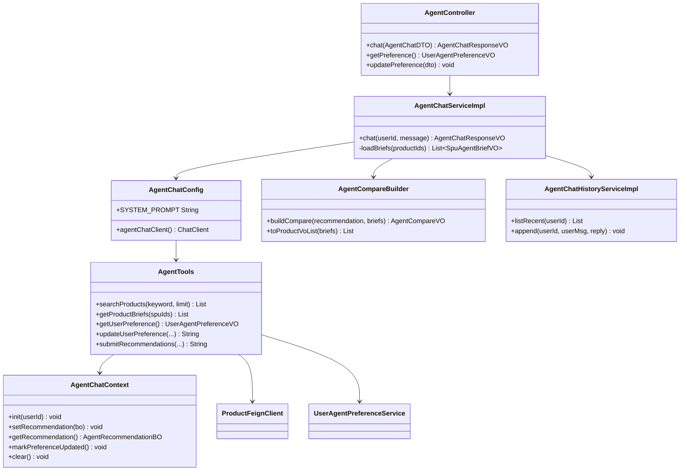

### 4.4 对话时序图

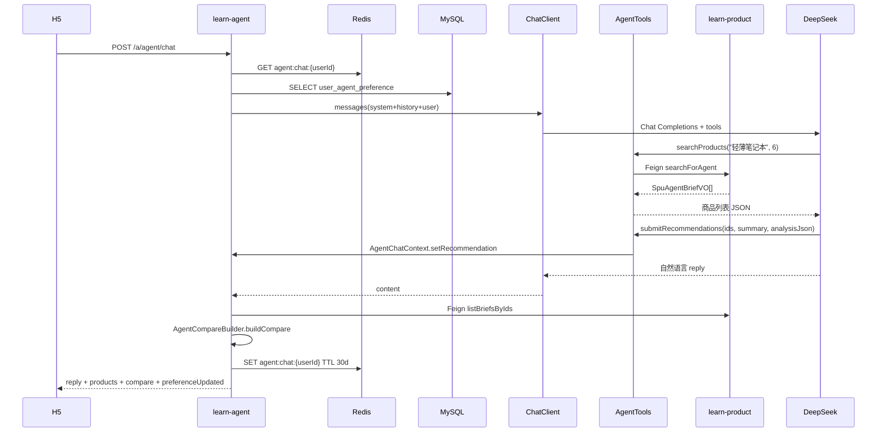

### 4.5 Tool Calling 设计

| Tool 方法 | 触发时机 | 下游 |
|-----------|----------|------|
| `getUserPreference` | 对话开始了解用户 | MySQL `user_agent_preference` |
| `updateUserPreference` | 用户表达预算/品质倾向 | MySQL UPSERT + `AgentChatContext.markPreferenceUpdated` |
| `searchProducts` | 提取关键词检索 | `ProductFeignClient.searchForAgent` |
| `getProductBriefs` | 按 ID 补全详情 | `ProductFeignClient.listBriefsByIds` |
| `submitRecommendations` | 分析完成 **必须调用一次** | 写入 `AgentChatContext` 结构化推荐 |

**searchProducts 参数安全化：**

```java
int safeLimit = limit == null ? 8 : Math.min(Math.max(limit, 1), 12);
```

**商品检索 SQL（SpuMapper.searchForAgent）：**

```sql
SELECT ... FROM spu
WHERE shop_id = #{shopId} AND status = 1
  AND (name LIKE CONCAT('%', #{keyword}, '%')
    OR selling_point LIKE CONCAT('%', #{keyword}, '%'))
ORDER BY sale_num DESC, spu_id DESC
LIMIT #{limit};
```

### 4.6 对比表组装算法（AgentCompareBuilder）

输入：`AgentRecommendationBO`（productIds、recommendation、items 含 pros/cons）+ `SpuAgentBriefVO[]`

输出：`AgentCompareVO`

| 步骤 | 说明 |
|------|------|
| 1 | 按 `productIds` 顺序排列商品（保持 LLM 推荐优先级） |
| 2 | 固定 5 行规格：`price`、`point`、`sales`、`pros`、`cons` |
| 3 | `price` 由分转元（`priceFee / 100.0`） |
| 4 | `pros`/`cons` 来自 LLM 提交的 `AgentItemAnalysisBO`，用 `；` 连接 |
| 5 | `recommended=true` 的商品在 `highlights` 中高亮 `price/sales/pros` 列 |

### 4.7 对话历史双存储

| 存储 | Key / 表 | 内容 | 用途 |
|------|----------|------|------|
| **服务端 Redis** | `agent:chat:{userId}` | 最近 20 条 `{role, content}` JSON | LLM 多轮上下文 |
| **客户端 localStorage** | `learn_mall_h5_agent_chat_{tokenSuffix}` | 完整 UI 消息（含商品卡片、对比表） | Tab 切换不丢失 |

**Redis 追加算法：**

```java
messages.add(user); messages.add(assistant);
while (messages.size() > historySize) messages.remove(0);  // 滑动窗口
SET key JSON TTL 30 days
```

**前端持久化：** `Agent.vue` 在每次发送/接收后调用 `saveAgentChatState`；`My.vue` 退出登录时 `clearAllAgentChatState`。

### 4.8 System Prompt 工作流（摘要）

1. 理解需求（功能、品类、预算、品质/性价比）；
2. `getUserPreference` → 必要时 `updateUserPreference`；
3. `searchProducts` 检索（可多次）；
4. `getProductBriefs` 补全；
5. 推荐 2～4 款，给出优缺点；
6. **必须** 调用 `submitRecommendations` 提交结构化结果。

---

## 5. 数据库详细设计

### 5.1 ER 图（核心实体）

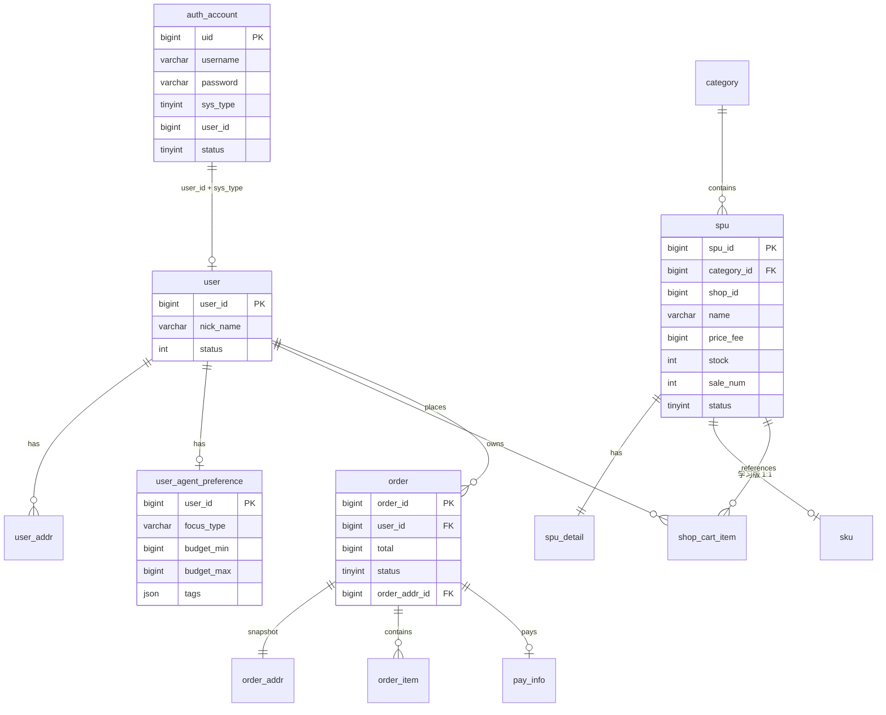

### 5.2 分期脚本

| 脚本 | 内容 |
|------|------|
| `phase1-auth-rbac.sql` | auth_account、menu、role、role_menu |
| `phase2-product.sql` | category、spu、sku、shop_cart_item + 种子数据 |
| `phase3-user.sql` | user、user_addr |
| `phase4-order.sql` | order、order_item、order_addr、pay_info |
| `phase5-agent.sql` | user_agent_preference |

### 5.3 核心表字段说明

#### 5.3.1 auth_account

| 字段 | 类型 | 说明 |
|------|------|------|
| uid | BIGINT PK | 全平台唯一 ID |
| username | VARCHAR(30) | 登录名，索引 `idx_username` |
| password | VARCHAR(64) | BCrypt 哈希 |
| sys_type | TINYINT | 0=C端 2=平台端 |
| user_id | BIGINT | 业务用户 ID |
| status | TINYINT | 1 启用 0 禁用 |

唯一约束：`uk_usertype_userid (sys_type, user_id)`。

#### 5.3.2 spu / sku

| 表 | 关键字段 | 索引 |
|----|----------|------|
| spu | price_fee(分)、stock、sale_num、status | idx_category, idx_shop |
| sku | spu_id UNIQUE（学习版每 SPU 一条 SKU） | uk_spu |

#### 5.3.3 order 相关

| 表 | 关键字段 | 索引 |
|----|----------|------|
| order | total(分)、status、order_addr_id | idx_user_id, **idx_status_create(status, create_time)** |
| order_item | spu_id、sku_id、price、count | idx_order_id |
| order_addr | 地址快照（与 user_addr 结构类似） | idx_user_id |
| pay_info | biz_pay_no、pay_status、pay_amount | idx_user_id |

**idx_status_create** 支撑超时关单扫描：`status=1 AND create_time < ?`。

#### 5.3.4 user_agent_preference

| 字段 | 类型 | 说明 |
|------|------|------|
| user_id | BIGINT PK | 与 user 表对齐 |
| focus_type | VARCHAR(20) | VALUE / QUALITY / BALANCED |
| budget_min/max | BIGINT | 预算区间（分） |
| tags | JSON | 如 `["轻便","送礼"]` |
| summary | VARCHAR(500) | 偏好摘要 |

### 5.4 Redis 数据结构汇总

| Key | 结构 | TTL | 服务 |
|-----|------|-----|------|
| `learn_oauth:token:access:*` | String(Object) | 30d | auth |
| `learn_oauth:token:refresh_to_access:*` | String | 30d | auth |
| `learn_oauth:token:uid_to_access:*` | Set | 30d | auth |
| `agent:chat:{userId}` | String(JSON Array) | 30d | agent |
| `learn_rbac:permission:*` | 按 CacheNames | 可配置 | rbac |

---

## 6. 接口与 DTO 设计（核心摘录）

### 6.1 认证

| 方法 | 路径 | 鉴权 | 请求 | 响应 |
|------|------|------|------|------|
| POST | `/ua/login` | 无 | `{principal, credentials, sysType}` | `TokenInfoVO` |
| POST | `/login_out` | Token | — | void |

### 6.2 订单

| 方法 | 路径 | 说明 |
|------|------|------|
| POST | `/a/order/submit` | `{addrId}` → orderId |
| POST | `/a/order/pay` | `{orderId}` 模拟支付 |
| PUT | `/a/order/cancel/{orderId}` | 用户取消 close_type=4 |
| GET | `/a/order/page` | 分页列表 |
| GET | `/a/order/detail/{orderId}` | 详情含 items + addr |

### 6.3 Agent

| 方法 | 路径 | 说明 |
|------|------|------|
| POST | `/a/agent/chat` | `{message}` → `AgentChatResponseVO` |
| GET | `/a/agent/preference` | 查询偏好 |
| PUT | `/a/agent/preference` | 手动更新偏好 |

**AgentChatResponseVO 结构：**

```json
{
  "reply": "根据你的预算，推荐以下商品…",
  "products": [{ "spuId", "name", "priceFee", "mainImgUrl", ... }],
  "compare": {
    "specs": [{ "key": "price", "label": "价格" }, ...],
    "items": [{ "spuId", "name", "recommended", "values": {...} }],
    "highlights": { "8": ["price", "sales", "pros"] },
    "recommendation": "总结推荐语"
  },
  "preferenceUpdated": true
}
```

---

## 7. 异常与错误码

| 场景 | 异常/码 | 说明 |
|------|---------|------|
| 未登录 | A00004 | AuthFilter Token 缺失或失效 |
| 服务器异常 | A00005 | 含 Redis 超时（如 Token 写入失败） |
| 库存不足 | 业务 msg | `lockStock` 影响行数 0 |
| 订单状态非法 | 业务 msg | 条件 UPDATE 失败 |
| Agent LLM 超时 | Gateway 120s | Feign/HTTP 客户端需同步放大 |

---

## 8. 配置项

| 配置键 | 默认值 | 模块 |
|--------|--------|------|
| `learn.mall.order.unpaid-timeout-minutes` | 30 | 超时关单 |
| `learn.mall.agent.chat-history-size` | 20 | Redis 对话条数 |
| `spring.ai.openai.api-key` | `${DEEPSEEK_API_KEY}` | DeepSeek |
| `spring.ai.openai.base-url` | `https://api.deepseek.com` | LLM 端点 |

---

## 9. 修订记录

| 版本 | 日期 | 修订内容 | 作者 |
|------|------|----------|------|
| 1.0 | 2026-07-04 | 初稿：认证、订单库存、Agent 详细设计 | — |
