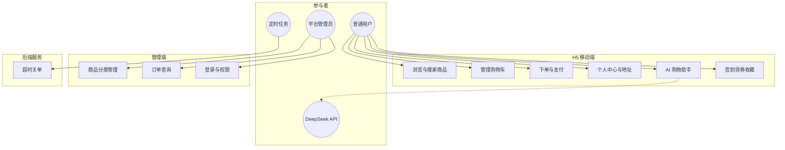
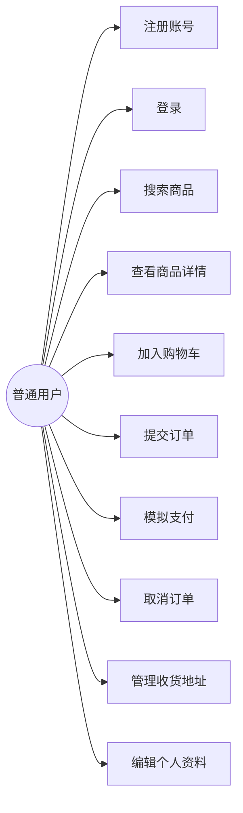
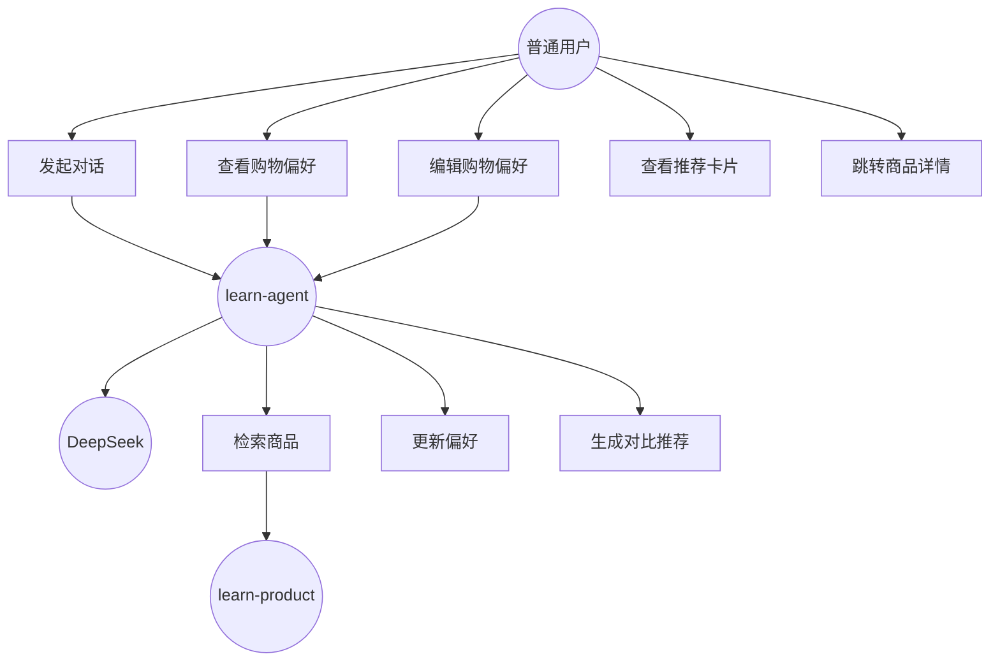
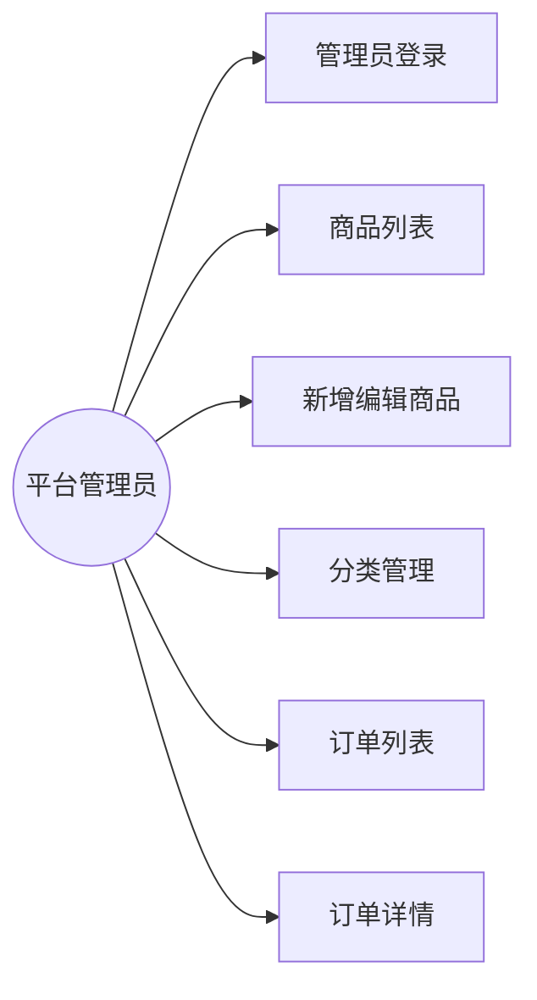

# Learn Mall 学习版 — 需求分析文档

| 文档版本 | 1.0 |
|---------|-----|
| 项目名称 | Learn Mall（mall4cloud-learn） |
| 编写日期 | 2026-07-04 |
| 文档状态 | 已实现基线（Phase 0～5） |

---

## 1. 项目概述

### 1.1 背景

Learn Mall 是基于 [Mall4cloud](https://github.com/gz-yami/mall4cloud) 微服务架构裁剪的学习型 B2C 商城项目，用于演示 Spring Cloud 微服务、前后端分离、以及 Spring AI 智能导购等能力。

### 1.2 建设目标

- 提供完整的 **H5 移动端购物** 与 **管理端后台** 双端能力；
- 采用 **Gateway + Nacos + 多微服务** 架构，便于学习分布式系统设计；
- 在标准电商流程（浏览、购物车、下单、支付）之上，引入 **AI 购物助手**，支持自然语言选品与偏好记忆。

### 1.3 系统范围

| 范围内 | 范围外（本版不包含） |
|--------|---------------------|
| 用户注册/登录、商品浏览与搜索 | 真实第三方支付（微信/支付宝） |
| 购物车、下单、模拟支付、订单管理 | 物流跟踪、售后退款完整流程 |
| 收货地址、个人资料 | 多店铺入驻、商家独立后台 |
| 管理端商品/分类/订单管理 | 真实优惠券核销、营销规则引擎 |
| AI 对话选品、参数对比、购物偏好 | 向量检索 RAG、SSE 流式对话 |
| 签到/领券/收藏（H5 前端演示） | 上述营销能力的完整后端 |

### 1.4 技术架构概览

```
┌─────────────┐     ┌─────────────┐
│  H5 (Vue3)  │     │ Admin(Vue3) │
└──────┬──────┘     └──────┬──────┘
       │                   │
       └─────────┬─────────┘
                 ▼
        ┌────────────────┐
        │ learn-gateway  │ :8000
        └────────┬───────┘
                 │ Nacos 服务发现
    ┌────────────┼────────────┬────────────┐
    ▼            ▼            ▼            ▼
 learn-auth  learn-product learn-user  learn-order
  :9101         :9114        :9115       :9116
    │            │            │            │
 learn-rbac  learn-agent   MySQL8      Redis
  :9102         :9117
```

---

## 2. 用户角色

| 角色 | 说明 | 访问端 | 典型账号 |
|------|------|--------|----------|
| **普通用户（C 端）** | 浏览商品、下单、使用 AI 助手 | H5 | user1 / 123456 |
| **平台管理员** | 商品/分类/订单管理、RBAC 权限 | Admin | admin / 123456 |
| **系统（定时任务）** | 扫描超时未支付订单并关闭 | 后端 | — |
| **外部 AI 服务** | DeepSeek 大模型 API | learn-agent | API Key 配置 |

---

## 3. 功能需求

### 3.1 功能需求总览

| 编号 | 模块 | 功能名称 | 优先级 | 端 |
|------|------|----------|--------|-----|
| FR-AUTH-01 | 认证 | 用户登录 | 高 | H5 / Admin |
| FR-AUTH-02 | 认证 | 用户注册 | 高 | H5 |
| FR-AUTH-03 | 认证 | 退出登录 | 中 | H5 / Admin |
| FR-PROD-01 | 商品 | 首页商品列表与搜索 | 高 | H5 |
| FR-PROD-02 | 商品 | 分类浏览 | 高 | H5 |
| FR-PROD-03 | 商品 | 商品详情 | 高 | H5 |
| FR-PROD-04 | 商品 | 管理端商品 CRUD | 高 | Admin |
| FR-PROD-05 | 商品 | 管理端分类管理 | 中 | Admin |
| FR-CART-01 | 购物车 | 加购/改数量/勾选 | 高 | H5 |
| FR-CART-02 | 购物车 | 购物车数量角标 | 中 | H5 |
| FR-USER-01 | 用户 | 个人资料查看与编辑 | 中 | H5 |
| FR-USER-02 | 用户 | 收货地址 CRUD | 高 | H5 |
| FR-ORDER-01 | 订单 | 提交订单（锁库存） | 高 | H5 |
| FR-ORDER-02 | 订单 | 模拟支付 | 高 | H5 |
| FR-ORDER-03 | 订单 | 订单列表/详情/取消 | 高 | H5 |
| FR-ORDER-04 | 订单 | 超时未付自动关闭 | 中 | 系统 |
| FR-ORDER-05 | 订单 | 管理端订单查询 | 高 | Admin |
| FR-AGENT-01 | AI 助手 | 自然语言对话选品 | 高 | H5 |
| FR-AGENT-02 | AI 助手 | 商品推荐卡片与参数对比 | 高 | H5 |
| FR-AGENT-03 | AI 助手 | 购物偏好记忆与手动编辑 | 高 | H5 |
| FR-AGENT-04 | AI 助手 | 对话历史持久化（页面切换不丢失） | 中 | H5 |
| FR-MKT-01 | 营销（演示） | 每日签到 / 领券中心 | 低 | H5 |
| FR-MKT-02 | 营销（演示） | 商品收藏 / 本地评论 | 低 | H5 |

---

### 3.2 认证与权限（FR-AUTH）

#### FR-AUTH-01 用户登录

- **描述**：用户输入用户名、密码及系统类型（H5：sysType=0，Admin：sysType=2），校验通过后返回 Token。
- **输入**：principal、credentials、sysType。
- **输出**：accessToken、refreshToken、expiresIn。
- **规则**：
  - 用户名格式校验；
  - 密码 BCrypt 比对；
  - Token 写入 Redis，后续请求携带 `Authorization` Header。

#### FR-AUTH-02 用户注册

- **描述**：H5 新用户注册，同时创建 auth 账号与 user 资料。
- **输出**：注册成功并自动登录返回 Token。

#### FR-AUTH-03 退出登录

- **描述**：清除服务端 Token 及客户端本地 Token；H5 退出时同步清除 Agent 对话本地缓存。

#### 管理端 RBAC

- Admin 登录后按角色加载动态菜单与路由；
- 接口路径 `/admin/**` 需管理员 Token 及权限校验。

---

### 3.3 商品模块（FR-PROD）

#### FR-PROD-01 首页商品列表与搜索

- 分页展示上架商品（双列卡片，含主图、名称、价格）；
- 支持按商品名称模糊搜索；
- 搜索框随机展示商品名称作为占位提示（轮播）；
- 首页轮播广告、签到/领券快捷入口。

#### FR-PROD-02 分类浏览

- 左侧一级分类 Tab，右侧二级分类与商品列表；
- 按分类筛选商品。

#### FR-PROD-03 商品详情

- 展示价格、卖点、销量、库存、详情 HTML、SKU（学习版每 SPU 一条 SKU）；
- 支持加入购物车、收藏（localStorage）、分享、规格弹窗；
- 商品评价（本地演示数据 + 用户可发表本地评论）。

#### FR-PROD-04 / FR-PROD-05 管理端

- 商品列表分页、上下架、新增/编辑（名称、卖点、价格、库存、详情等）；
- 分类树维护。

---

### 3.4 购物车（FR-CART）

- 登录后可查看购物车列表；
- 修改商品数量、勾选/取消勾选、删除；
- 勾选商品结算跳转订单确认页；
- 底部导航购物车 Tab 显示已勾选数量角标；
- 未登录引导登录。

---

### 3.5 用户中心（FR-USER）

#### FR-USER-01 个人资料

- 查看/编辑昵称、头像；
- 「我的」页展示订单快捷入口、服务宫格、猜你喜欢。

#### FR-USER-02 收货地址

- 地址列表、新增、编辑、删除；
- 下单时选择收货地址。

---

### 3.6 订单模块（FR-ORDER）

#### FR-ORDER-01 提交订单

- 从购物车勾选商品生成订单；
- 调用 product 服务 **锁库存**；
- 写入订单主表、订单项、地址快照；
- 删除已下单购物车项。

#### FR-ORDER-02 模拟支付

- 待付款订单一键模拟支付；
- 更新订单状态为已付款，**确认扣减库存**。

#### FR-ORDER-03 用户订单管理

- 订单列表 Tab：全部 / 待付款 / 待发货（映射已付）/ 待收货与退款（演示空态）；
- 订单详情、待付款订单可取消（**解锁库存**）。

#### FR-ORDER-04 超时关闭

- 定时任务扫描超过配置时间（默认 30 分钟）未支付订单；
- 状态置为关闭并解锁库存。

#### FR-ORDER-05 管理端订单

- 分页查询、按状态筛选、查看订单详情快照。

**订单状态定义：**

| 状态码 | 含义 |
|--------|------|
| 1 | 待付款 |
| 2 | 已付款（H5「待发货」Tab 映射此状态） |
| 5 | 已完成 |
| 6 | 已关闭 |

---

### 3.7 AI 购物助手（FR-AGENT）

#### FR-AGENT-01 自然语言对话选品

- 用户用自然语言描述需求（功能、预算、场景），无需知道商品名称；
- 后端通过 Spring AI + DeepSeek 理解意图，调用 **searchProducts** 工具按名称/卖点检索商品；
- 需登录后使用。

#### FR-AGENT-02 推荐与对比

- 助手返回文本回复 + 商品推荐卡片（可点击进详情）；
- 展示参数对比表（价格、卖点、销量、优缺点）及总结推荐语；
- 通过 **submitRecommendations** 工具结构化提交推荐结果。

#### FR-AGENT-03 购物偏好

- 对话中识别「性价比 / 品质 / 预算 / 标签」等倾向，自动调用 **updateUserPreference** 持久化到 MySQL；
- 偏好类型：`VALUE`（性价比）、`QUALITY`（品质）、`BALANCED`（均衡）；
- 「我的 → 购物偏好」页面可预览并手动修改；
- Agent 页右上角「偏好」快捷入口。

#### FR-AGENT-04 对话历史

- 服务端 Redis 保留最近 20 条文本历史，供 LLM 多轮上下文；
- 客户端 localStorage 保留完整 UI 消息（含商品卡片），切换 Tab 返回不丢失；
- 退出登录清除本地对话缓存。

---

### 3.8 营销演示功能（FR-MKT）

> 以下主要为 H5 前端演示，部分数据存 localStorage，无完整后端营销引擎。

| 功能 | 说明 |
|------|------|
| 每日签到 | 连续签到天数、本地奖励记录 |
| 领券中心 | 优惠券列表、领取状态（localStorage） |
| 我的收藏 | 收藏商品列表（localStorage） |
| 猜你喜欢 | 首页/购物车/我的页推荐商品 |

---

## 4. 非功能需求

### 4.1 性能需求（NFR-PERF）

| 编号 | 需求描述 | 指标/说明 |
|------|----------|-----------|
| NFR-PERF-01 | 商品列表接口响应 | 正常负载下 P95 < 500ms（本地开发环境） |
| NFR-PERF-02 | 网关路由转发 | 单跳 Feign/HTTP，避免级联超时 |
| NFR-PERF-03 | AI 对话超时 | 前端请求超时 120s；Feign 连接 3s、读 5s |
| NFR-PERF-04 | Redis 操作 | 连接/命令超时 3s，防止中间件卡死拖垮线程 |

### 4.2 可用性与可靠性（NFR-AVAIL）

| 编号 | 需求描述 | 指标/说明 |
|------|----------|-----------|
| NFR-AVAIL-01 | 服务注册发现 | 依赖 Nacos，单实例本地部署 |
| NFR-AVAIL-02 | 订单库存一致性 | 下单锁库存、取消/超时解锁、支付确认扣减，事务保证 |
| NFR-AVAIL-03 | 中间件健康 | MySQL、Redis 异常时 auth/Agent 等应快速失败并返回明确错误 |

### 4.3 安全需求（NFR-SEC）

| 编号 | 需求描述 | 说明 |
|------|----------|------|
| NFR-SEC-01 | 身份认证 | `/a/**` 需 Token；`/ua/**` 公开；`/admin/**` 需管理员权限 |
| NFR-SEC-02 | 密码存储 | BCrypt 加密，防时序攻击处理 |
| NFR-SEC-03 | 服务间调用 | Feign 内部接口 `/feign/insider/**` 使用 key/secret 校验 |
| NFR-SEC-04 | AI Key 安全 | `DEEPSEEK_API_KEY` 仅服务端环境变量，不入库、不提交代码库 |
| NFR-SEC-05 | 工具调用隔离 | LLM 仅通过预定义 Tool 访问商品与偏好，不直接访问数据库 |

### 4.4 可维护性（NFR-MAINT）

| 编号 | 需求描述 | 说明 |
|------|----------|------|
| NFR-MAINT-01 | 统一响应格式 | `ServerResponseEntity`：code / msg / data |
| NFR-MAINT-02 | 全局异常处理 | HTTP 200 + 业务 code 返回错误 |
| NFR-MAINT-03 | 模块化 | learn-common、learn-api、各业务微服务独立部署 |
| NFR-MAINT-04 | 数据库脚本分阶段 | phase1～phase5 SQL 增量初始化 |

### 4.5 兼容性（NFR-COMPAT）

| 编号 | 需求描述 | 说明 |
|------|----------|------|
| NFR-COMPAT-01 | 后端 | Java 17、Spring Boot 4.0.3、Spring AI 2.0 |
| NFR-COMPAT-02 | 前端 | Vue 3 + Vite，H5 适配移动端安全区 |
| NFR-COMPAT-03 | 浏览器 | 现代浏览器（Chrome、Safari、Edge 近期版本） |

### 4.6 用户体验（NFR-UX）

| 编号 | 需求描述 | 说明 |
|------|----------|------|
| NFR-UX-01 | H5 底部导航 | 5 Tab：首页、分类、Agent、购物车、我的；Agent 居中突出 |
| NFR-UX-02 | 导航栏视觉 | 毛玻璃背景、商品卡片轻阴影 |
| NFR-UX-03 | Agent 交互 | 输入中 loading 动画；快捷提问 chips；对话本地持久化 |
| NFR-UX-04 | 未登录引导 | 购物车、Agent、订单等需登录功能跳转登录页 |

---

## 5. 用例图

### 5.1 系统总体用例图



### 5.2 H5 购物用例图



### 5.3 AI 购物助手用例图



### 5.4 管理端用例图



---

## 6. 主要用例规约

### 6.1 UC-ORDER-01 提交订单

| 项目 | 内容 |
|------|------|
| **用例名称** | 提交订单 |
| **参与者** | 普通用户（主）、learn-order、learn-product、learn-user |
| **前置条件** | 用户已登录；购物车有勾选商品；已选择有效收货地址 |
| **主成功场景** | 1. 用户点击「去结算」并确认地址<br>2. 系统校验购物车与地址<br>3. 锁定商品库存<br>4. 创建订单及订单项<br>5. 删除购物车已购项<br>6. 跳转支付页 |
| **扩展场景** | 3a. 库存不足 → 提示失败，不创建订单<br>4a. 锁库存后落单失败 → 回滚解锁库存 |
| **后置条件** | 生成待付款订单；库存被锁定 |

### 6.2 UC-AGENT-01 AI 对话选品

| 项目 | 内容 |
|------|------|
| **用例名称** | AI 对话选品 |
| **参与者** | 普通用户（主）、learn-agent、DeepSeek、learn-product |
| **前置条件** | 用户已登录；learn-agent 已配置有效 API Key；Redis/MySQL 可用 |
| **主成功场景** | 1. 用户输入自然语言需求<br>2. 系统加载偏好与历史上下文<br>3. LLM 调用 searchProducts 检索商品<br>4. LLM 分析优缺点并 submitRecommendations<br>5. 返回文本、商品卡片、对比表<br>6. 持久化对话历史 |
| **扩展场景** | 3a. 无匹配商品 → 引导用户补充描述<br>2a. 用户表达新偏好 → 调用 updateUserPreference |
| **后置条件** | Redis 更新 LLM 历史；前端 localStorage 更新 UI 消息 |

### 6.3 UC-AUTH-01 用户登录

| 项目 | 内容 |
|------|------|
| **用例名称** | 用户登录 |
| **参与者** | 普通用户 / 管理员、learn-auth |
| **前置条件** | 账号已在 auth_account 中注册 |
| **主成功场景** | 1. 输入用户名密码及 sysType<br>2. 校验通过<br>3. 生成 Token 存 Redis<br>4. 返回 Token 给客户端 |
| **扩展场景** | 2a. 用户名或密码错误 → 返回失败提示 |
| **后置条件** | 客户端存储 Token，后续请求携带 Authorization |

---

## 7. 数据需求（概要）

| 数据域 | 核心实体 | 存储 |
|--------|----------|------|
| 认证 | auth_account | MySQL |
| 权限 | menu、role、role_menu | MySQL |
| 商品 | category、spu、spu_detail、sku | MySQL |
| 购物车 | shop_cart_item | MySQL |
| 用户 | user、user_addr | MySQL |
| 订单 | order、order_item、order_addr、pay_info | MySQL |
| Agent 偏好 | user_agent_preference | MySQL |
| Token / 对话 | accessToken、agent:chat:{userId} | Redis |
| H5 演示 | 签到、领券、收藏、Agent UI 消息 | localStorage |

---

## 8. 接口与集成需求

| 集成点 | 协议 | 说明 |
|--------|------|------|
| 客户端 ↔ Gateway | HTTP/JSON | 统一前缀 `/learn-{service}/...` |
| 服务 ↔ Nacos | HTTP | 服务注册与发现 |
| learn-order ↔ learn-product | OpenFeign | 购物车、锁/解锁/确认库存 |
| learn-order ↔ learn-user | OpenFeign | 收货地址 |
| learn-agent ↔ learn-product | OpenFeign | Agent 商品检索 |
| learn-agent ↔ DeepSeek | HTTPS OpenAI 兼容 | Chat Completions + Tool Calling |
| 中间件 | TCP | MySQL :3306、Redis :6379 |

---

## 9. 约束与假设

1. **单店铺**：默认 shopId=1，不支持多商户；
2. **模拟支付**：不对接真实支付渠道，仅状态流转演示；
3. **Agent 需登录**：偏好与 LLM 历史绑定 userId；
4. **学习版 SKU**：每个 SPU 仅一条 SKU，简化库存模型；
5. **营销能力**：签到/领券/收藏等为前端演示，业务规则未完全后端化；
6. **部署环境**：开发期以 Windows + Docker（MySQL/Redis/Nacos）+ 本地 JVM 为主。

---

## 10. 验收标准（摘要）

| 场景 | 验收条件 |
|------|----------|
| 完整购物流 | 登录 → 加购 → 结算 → 模拟支付 → 订单列表可见 |
| 超时关单 | 待付款订单超过 30 分钟自动关闭，库存恢复 |
| Admin 管理 | admin 登录后可管理商品、查看订单 |
| AI 选品 | 登录后描述需求，返回商品卡片与对比表，可进详情 |
| 偏好记忆 | 对话表达偏好后，「购物偏好」页可见；改偏好后推荐策略变化 |
| 对话持久化 | Agent 页对话后切换 Tab 再返回，历史消息仍在 |
| 安全 | 未带 Token 访问 `/a/**` 被拒绝；API Key 不在前端暴露 |

---

## 11. 修订记录

| 版本 | 日期 | 修订内容 | 作者 |
|------|------|----------|------|
| 1.0 | 2026-07-04 | 初稿，覆盖 Phase 0～5 已实现功能 | — |
